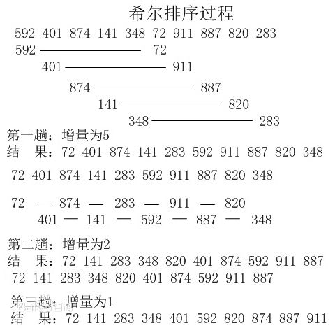

# 排序算法实现

## 十大排序的时空复杂度

## 算法详解
### 1. 快速排序
#### 算法步骤
1. 从数列中挑出一个元素，称为 “基准”（pivot）;
2. 重新排序数列，所有元素比基准值小的摆放在基准前面，所有元素比基准值大的摆在基准的后面（相同的数可以到任一边）。在这个分区退出之后，该基准就处于数列的中间位置。这个称为分区（partition）操作；
3. 递归地（recursive）把小于基准值元素的子数列和大于基准值元素的子数列排序；

递归的最底部情形，是数列的大小是零或一，也就是永远都已经被排序好了。虽然一直递归下去，但是这个算法总会退出，因为在每次的迭代（iteration）中，它至少会把一个元素摆到它最后的位置去。

### 2. 希尔排序
#### 概要
希尔排序，也称递减增量排序算法，是插入排序的一种更高效的改进版本。但希尔排序是非稳定排序算法。
希尔排序是基于插入排序的以下两点性质而提出改进方法的：
- 插入排序在对几乎已经排好序的数据操作时，效率高，即可以达到线性排序的效率；
- 但插入排序一般来说是低效的，因为插入排序每次只能将数据移动一位；

希尔排序的基本思想是：先将整个待排序的记录序列分割成为若干子序列分别进行直接插入排序，待整个序列中的记录“基本有序”时，再对全体记录进行依次直接插入排序。

#### 算法步骤
1. 选择一个增量序列 t1，t2，……，tk，其中 ti > tj, tk = 1；
2. 按增量序列个数 k，对序列进行 k 趟排序；
3. 每趟排序，根据对应的增量 ti，将待排序列分割成若干长度为 m 的子序列，分别对各子表进行直接插入排序。仅增量因子为 1 时，整个序列作为一个表来处理，表长度即为整个序列的长度。

#### 图示

### 7. 堆排序
#### 算法步骤
1. 创建一个堆 H[0……n-1]；
2. 把堆首（最大值）和堆尾互换；
3. 把堆的尺寸缩小 1，并调用 shift_down(0)，目的是把新的数组顶端数据调整到相应位置；
4. 重复步骤 2，直到堆的尺寸为 1。

### 8. 计数排序
#### 算法步骤
1. 花O(n)的时间扫描整个序列A，找出最小和最大值[min,max]
2. 开辟一块内存区间创建新的数组B，长度是[max-min+1]
3. 数组B中index的元素记录的值是A中对应元素出现的次数
4. 最后遍历数组B，输出相应元素

### 9. 桶排序
#### 概要
桶排序是计数排序的升级版。它利用了函数的映射关系，高效与否的关键就在于这个映射函数的确定。为了使桶排序更加高效，我们需要做到这两点：
- 在额外空间充足的情况下，尽量增大桶的数量
- 使用的映射函数能够将输入的 N 个数据均匀的分配到 K 个桶中

同时，对于桶中元素的排序，选择何种比较排序算法对于性能的影响至关重要。

1. 什么时候最快
当输入的数据可以均匀的分配到每一个桶中。

2. 什么时候最慢
当输入的数据被分配到了同一个桶中。

#### 算法步骤
1. 设定固定数量的空桶
2. 把数据放入对应桶中
3. 对非空桶进行桶内排序
4. 拼接不为空的桶，得到最终结果

### 10. 基数排序
#### 算法步骤
1. 将所有待排序数值统一数位长度，短的补零
2. 从最低位开始依次排序
3. 从最低位开始到最高位依次排序，则一次排序完成。

### 基数排序 vs 计数排序 vs 桶排序

这三种排序算法都利用了桶的概念，但对桶的使用方法上有明显差异：
- 基数排序：根据键值的每位数字来分配桶；
- 计数排序：每个桶只存储单一键值；
- 桶排序：每个桶存储一定范围的数值；

## 内置
- 

## 参考
### 数组排序
- [十大排序-动图](https://mp.weixin.qq.com/s/vn3KiV-ez79FmbZ36SX9lg)
- [桶排序 Go语言实现经典算法](http://www.chinacion.cn/article/8180.html)
- [golang实现常用排序算法](https://blog.csdn.net/benben_2015/article/details/79231929)
- [golang 各种排序大比拼](https://blog.csdn.net/Mrs_len/article/details/54094390)
- [golang实现常用的排序算法](https://blog.csdn.net/qq_20432379/article/details/78715080)
- [go语言实现7大排序算法](https://blog.csdn.net/webxscan/article/details/68065474)
### 链表排序
- [链表排序（冒泡、选择、插入、快排、归并、希尔、堆排序）](https://www.cnblogs.com/TenosDoIt/p/3666585.html)