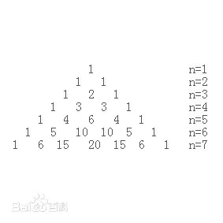

## 杨辉三角

## 特性
前提：每行端点与结尾的数为1.
（与上图中的n不同，这里第一行定义为n=1）
1. 每个数等于它上方两数之和。
2. 每行数字左右对称，由1开始逐渐变大。
3. 第n行的数字有n项。
4. 第n行的m个数可表示为 C(n-1，m-1)，即为从n-1个不同元素中取m-1个元素的组合数。
5. 第n行的第m个数和第n-m+1个数相等 ，为组合数性质之一。
6. 每个数字等于上一行的左右两个数字之和。可用此性质写出整个杨辉三角。即第n+1行的第i个数等于第n行的第i-1个数和第i个数之和，这也是组合数的性质之一。即 C(n+1,i)=C(n,i)+C(n,i-1)。
7. (a+b)n的展开式中的各项系数依次对应杨辉三角的第(n+1)行中的每一项。
8. 将第2n+1行第1个数，跟第2n+2行第3个数、第2n+3行第5个数……连成一线，这些数的和是第4n+1个斐波那契数；将第2n行第2个数(n>1)，跟第2n-1行第4个数、第2n-2行第6个数……这些数之和是第4n-2个斐波那契数。
9. 将第n行的各数值，分别乘以10的列数m-1次方，然后把这些数值相加的和等于11的n-1次方。例子：第11行数分别为1,10,45,120,210,252,210,120,45,10,1，则11^10 = 1*10^0+10*10^1+45*10^2+...+1*10^10 =25937424601

## 参考
- [杨辉三角](https://baike.baidu.com/item/%E6%9D%A8%E8%BE%89%E4%B8%89%E8%A7%92)
- [Golang实现杨辉三角](http://dongcoder.com/detail-1128614.html)